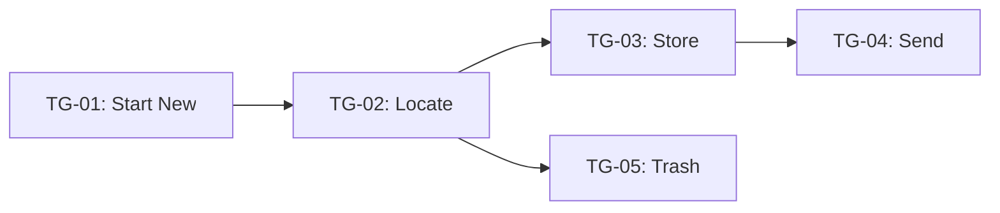
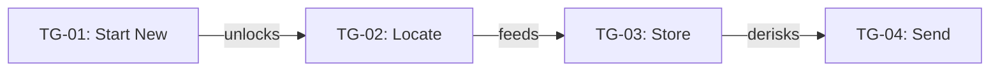
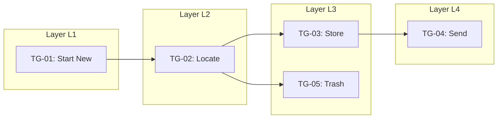
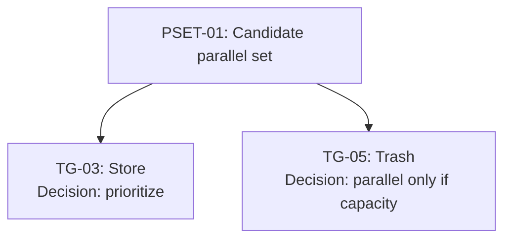
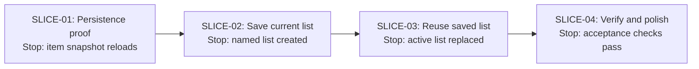

# Visual Pack

The Visual Pack is the diagram/output layer for the Implementation Planner and Tracker. It makes the plan easier to inspect at a glance, similar in spirit to Dumplink-style dump boards, task-group buckets, sequencers, arrangers, appetite timepieces, and risk-state views.

Use this guide when the implementation plan needs to produce visual artifacts for humans and agents.

## Required visual outputs

A complete implementation plan should include these visual projections when enough information exists:

1. **Dump Board** — raw tasks before structure or order.
2. **Task Group Grid** — tasks clustered into named or unnamed task-group buckets.
3. **Risk State Board** — task groups shown by uncertainty / certainty / done / cut state.
4. **Interrelationship Diagram** — arrows showing which task groups unlock, feed, derisk, or block others.
5. **Foliation / Layer Diagram** — dependency layers over time.
6. **Parallelization Map** — which same-layer groups can run in parallel, should wait, or need a spike.
7. **Appetite / Progress Snapshot** — time budget, elapsed/remaining time, task-group progress, and scope-pressure signal.
8. **Slice Sequence Map** — the initial build slices in order, with stop conditions.

These are projections of the planning tables. Tables remain the source of truth; visuals help review, communication, and agent handoff.

## 1. Dump Board

Use this to show the rough implementation details before clustering.

```text
DUMP
┌────────────────────────────────────┐
│ T-01  ...                          │
│ T-02  ...                          │
│ T-03  ...                          │
│ T-04  ...                          │
│ T-05  ...                          │
└────────────────────────────────────┘
```

## 2. Task Group Grid

Use this to show task clusters. Keep the initial project to roughly 10 groups or fewer. If there are more than 10 meaningful groups, consider splitting the project.

```text
TASK GROUP GRID

┌──────────────────────┐ ┌──────────────────────┐ ┌──────────────────────┐
│ TG-01: Name          │ │ TG-02: Name          │ │ TG-03: Name          │
│ T-01, T-04           │ │ T-02, T-07           │ │ T-03, T-05           │
│ State: figuring-out  │ │ State: figured-out   │ │ State: not-started   │
└──────────────────────┘ └──────────────────────┘ └──────────────────────┘
```

## 3. Risk State Board

Use this to show uncertainty and certainty at the task-group level. Do not call a group done while important tasks remain in the figuring-out state.

```text
RISK STATE BOARD

TG-01 Start New
Unknown: 2 / 5
Known:   3 / 5
Risk:    [████████░░] figuring-out

TG-02 Locate
Unknown: 0 / 4
Known:   4 / 4
Risk:    [██████████] figured-out
```

Suggested states:

- `not-started`
- `figuring-out`
- `figured-out`
- `executing-down`
- `done`
- `cut`

## 4. Interrelationship Diagram

Use Mermaid to show causal arrows.



Label arrows when helpful:



## 5. Foliation / Layer Diagram

Use this to show dependency layers over time. Same-layer groups are dependency-parallel candidates, not automatically safe to run in parallel.



## 6. Parallelization Map

Use this to separate dependency-parallel from judgment-parallel.

```text
PARALLELIZATION MAP

PSET-01: TG-03 Store + TG-05 Trash
Dependency status: same layer after TG-02
Unknown profile: TG-03 has higher unknown; TG-05 is bounded
Capacity conflict: possible shared draft model
Decision: prioritize TG-03; run TG-05 only if separate capacity exists
```

Optional Mermaid:



## 7. Appetite / Progress Snapshot

Use this to show budget pressure and risk state together.

```text
APPETITE SNAPSHOT

Appetite: 6 weeks
Elapsed:  2 weeks
Remaining: 4 weeks
Time:     [██████░░░░░░░░░░░░] 33%

Task groups:
Done:          1 / 6
Figured out:   2 / 6
Figuring out:  2 / 6
Not started:   1 / 6
Cut:           0 / 6

Scope pressure: medium
Reason: one core group still figuring-out, but time remaining is healthy.
```

## 8. Slice Sequence Map

Use this to show the first slices and their stop conditions.



## Quality rules

- Include diagrams only when they clarify the plan.
- Keep tables authoritative; visuals are projections.
- Use stable IDs in every visual.
- Do not invent precision. Use placeholders when data is missing.
- Separate dependency-parallel from judgment-parallel.
- Show unknowns visually when possible.
- Show appetite pressure when a time budget exists.
- Keep visual outputs plain enough to work in GitHub Markdown.
