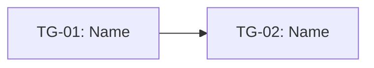

# Dumplink

Use this skill after a project has been framed, shaped, and selected for a fixed time budget. The job is to help a Small Launch Team decompose the shaped project without shredding its intent into disconnected tickets.

Dumplink is for deliberate build-cycle work, not reactive ticket intake. It keeps the project whole while helping the team discover vertical task groups that can be finished, judged, parallelized where safe, and shipped within an appetite.

## Goal

Produce an implementation plan that shows:

- the raw task dump from the shaped project
- clustered task groups that form vertical slices of shippable behavior
- unknowns, knowns, and done states at the task-group level
- causal dependencies between task groups
- foliated dependency layers
- a parallelization plan that separates dependency-parallel from judgment-parallel
- a build sequence that starts with risky and dependency-unlocking work
- possible cuts if the appetite runs out
- a compact handoff packet for the active implementation task group

## Source concept

Dumplink uses four core moves:

1. **DUMP** — list everything the team thinks must happen to build the shaped project.
2. **CLUSTER** — group tasks into isolated vertical task groups that can produce judgeable behavior.
3. **FOLIATE** — convert interrelationships into dependency layers and parallelization candidates.
4. **SEQUENCE** — choose the actual order using dependencies, unknowns, capacity, and stop conditions.

The source tool and concept are from Dumplink: https://github.com/klausbreyer/dump.link and https://dump.link.

## When to use

Use this when:

- a shaped project has been bet on
- the team has an appetite, usually 2–6 weeks
- work is meaningful enough that horizontal task planning would lose the plot
- the team needs to preserve intent while still making implementation concrete
- the next best step is to create vertical task groups, not a giant ticket backlog
- the team needs to know what can happen in parallel and what must happen first

Do not use this when:

- the work is reactive support, bugs, or interrupt-driven operations
- the problem is still unframed
- no direction has been selected
- the user only needs a raw todo list

## Inputs

Ask for or infer from available artifacts:

- shaped project pitch or shaping doc
- appetite / time budget
- selected approach and non-goals
- known risks, rabbit holes, and constraints
- breadboard, if available
- existing codebase or implementation context, if available
- acceptance checks or demo target

If the source material is weak, still proceed, but label assumptions.

## Output

Create these sections:

1. Project boundary
2. Task dump
3. Task groups
4. Unknowns / knowns / done states
5. Dependency map
6. Foliated dependency layers
7. Parallelization plan
8. Build sequence
9. Scope cuts
10. Acceptance checks
11. Agent handoff packet

## Method

### 1. Preserve the shaped intent

Start by restating the shaped project in compact form:

- appetite
- target user / operator
- desired outcome
- selected approach
- non-goals
- what must remain true

Do not immediately turn everything into implementation tickets. First preserve the whole.

### 2. Dump tasks

Create an unordered list of likely tasks. Include design, product, data, content, migration, technical, QA, and launch tasks when relevant.

Rules:

- keep tasks rough at first
- do not sequence while dumping
- include unknowns as tasks to investigate
- do not hide design or decision work
- do not over-split into microscopic chores

Use IDs such as `T-01`, `T-02`, `T-03`.

Task table:

| ID | Task | Type | Known/Unknown | Notes |
|---|---|---|---|---|
| T-01 |  | product / design / code / data / QA / launch | unknown |  |

### 3. Cluster into task groups

Group tasks by what can be completed together and judged in isolation from the rest.

A good task group:

- produces one judgeable behavior or project state
- cuts vertically through the system when possible
- has clear inputs and outputs
- can be demoed or inspected
- avoids arbitrary categories like frontend/backend/design unless the work truly cannot be sliced vertically

Use IDs such as `TG-01`, `TG-02`, `TG-03`.

Task group table:

| ID | Name | Included tasks | User/system behavior produced | Risk state | Cuttable? | Notes |
|---|---|---|---|---|---|---|
| TG-01 |  | T-01, T-04 |  | not-started / figuring-it-out / executing-down / done / cut | no |  |

### 4. Mark state by risk, not task count

Track state at the task-group level:

- `not-started` — no meaningful learning or execution yet
- `figuring-it-out` — unknowns remain
- `executing-down` — key unknowns are solved; work is being completed
- `done` — produces the intended behavior and passes acceptance checks
- `cut` — intentionally removed to protect the appetite

The state of a task group is the state of its riskiest important task. Do not let a pile of easy completed tasks hide one unresolved unknown.

### 5. Map dependencies

Draw causal links between task groups. Ask:

- what input does this group need before it can be completed?
- what does this group unlock?
- what unknown could cause rework if found late?
- what group has more outgoing than incoming dependencies?

Dependency table:

| ID | From | To | Why this dependency exists | Risk if delayed |
|---|---|---|---|---|
| D-01 | TG-01 | TG-03 |  |  |

Optional Mermaid:



### 6. Foliate dependency layers

Foliation converts the dependency map into layers.

First ask only the dependency question:

> If all unknowns were equal, what order is valid based on what must feed what?

Process:

1. Identify terminal task groups: groups with no outgoing arrows.
2. Work backward/upward from terminal groups to identify what must feed them.
3. Group task groups into layers based on what can start once prerequisites are available.
4. Treat same-layer groups as dependency-parallel candidates.
5. Do not treat same-layer groups as automatically worth parallelizing.

Foliation table:

| Layer | Task groups | Dependency reason | Can start when... | Dependency-parallel candidates |
|---|---|---|---|---|
| L1 | TG-01, TG-03 | no unmet inbound dependencies | project starts | yes |
| L2 | TG-02 | needs TG-01 output | TG-01 stop condition met | no |

### 7. Decide parallelization using dependencies plus unknowns

Dependencies and unknowns are two different dimensions.

Use foliation to find valid starting sets. Then use unknowns and capacity to decide the actual work order.

Decision rules:

- If a dependency-ready group has a project-killing unknown, start it first or run a spike immediately.
- If multiple dependency-ready groups are well understood, parallelize only if team capacity exists.
- If one group is easy and another has a major unknown, do not let easy work crowd out the unknown.
- If groups share a scarce person, fragile code area, external dependency, or decision-maker, treat them as capacity-conflicted.
- If a dependency-ready group is not needed soon, it can wait.

Parallelization table:

| Candidate set | Groups | Dependency status | Unknown profile | Capacity conflict? | Decision | Rationale |
|---|---|---|---|---|---|---|
| PSET-01 | TG-01, TG-03 | same layer | TG-03 has major unknown | no | start TG-03 first, TG-01 can follow/parallel if capacity allows | project fails if TG-03 is not solved |

### 8. Sequence the build

Sequence after considering:

1. dependency validity from foliation
2. unknown severity
3. time sensitivity
4. capacity constraints
5. what each group must enable next

Prefer this order:

1. project-killing unknowns among dependency-ready groups
2. dependency-unlocking task groups
3. core user-visible behavior
4. finishing / polish / launch items

Do not start with easy polish if a hidden unknown can sink the project later.

Build sequence table:

| Order | Task group | Layer | Why now | What it must enable next | Parallel with | Stop when... |
|---|---|---|---|---|---|---|
| 1 | TG-03 | L1 | biggest project-killing unknown among valid starts | decision for TG-04 | none | the risky path is proven or cut |

### 9. Identify scope cuts

Variable scope is the point. If the appetite is fixed, define cuts before panic.

For each possible cut, state:

- what is removed
- what still works
- what user/business value remains
- what follow-up decision is needed later

Scope cut table:

| ID | Remove/defer | Preserved behavior | Cost of cutting | Later decision |
|---|---|---|---|---|
| CUT-01 |  |  |  |  |

### 10. Write acceptance checks

Acceptance checks should judge behavior at the task-group and project level.

Use IDs such as `AC-01`, `AC-02`, `AC-03`.

Use checks like:

- A user can complete X end-to-end.
- The system preserves Y state after Z.
- The operator can see whether W is unknown, known, done, or cut.
- The project can ship some version without the cut items.

### 11. Prepare agent handoff

End with a compact handoff packet:

```text
Active task group:
Source artifacts:
Must preserve:
Do not build:
Relevant tasks:
Dependency layer:
Parallelization decision:
Known unknowns:
Dependencies:
Acceptance check:
Stop condition:
```

## Quality bar

A good Dumplink output:

- keeps the shaped project whole
- avoids horizontal task silos
- makes vertical task groups independently judgeable
- reveals unknowns early
- maps dependencies explicitly
- foliates the graph into valid dependency layers
- distinguishes dependency-parallel from judgment-parallel
- sequences by risk, dependency, capacity, and right-to-left stop conditions
- names cuts explicitly
- gives an implementation agent one bounded task group at a time

## Common failure modes

- Turning the shaped project into a flat ticket backlog
- Clustering by discipline instead of shippable behavior
- Treating task count as progress
- Hiding unknowns inside vague engineering tasks
- Treating same-layer work as automatically parallelizable
- Ignoring capacity conflicts between “independent” groups
- Sequencing by ease instead of risk
- Deferring dependency-unlocking work too late
- Treating scope cuts as failure instead of appetite discipline
- Feeding an agent the whole project instead of the active task group
