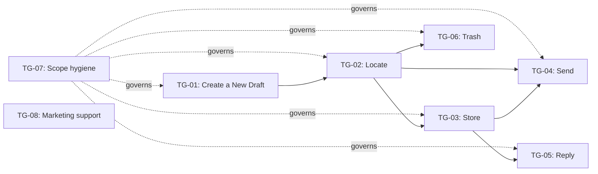

# Implementation Plan: Message Drafts

This example is adapted from:

- Shape Up Chapter 12 case study, “Message drafts”: https://basecamp.com/shapeup/3.3-chapter-12#case-study-message-drafts
- Dumplink demo transcript supplied by the user for: https://www.youtube.com/watch?v=CSEhIJ7safA

## 1. Readiness check

| Dimension | Status | Evidence | Concern | Needed before build? |
|---|---|---|---|---|
| Problem / outcome | clear | Users need to create, find, edit, send, and discard message drafts. | The original case begins from a task list, not a formal PRD. | no |
| Appetite | partial | Dumplink demo emphasizes an appetite timepiece; exact appetite not specified in the case. | Need a real team appetite for actual planning. | no, example only |
| Selected approach | clear | Drafts are created, stored, located, edited, sent, replied to, and trashed. | Scopes emerge during work. | no |
| Non-goals | partial | Nice-to-haves and marketing/supporting work can be scoped separately. | Exact non-goals are inferred from the case/demo. | no |
| User-visible behavior | clear | Start new draft, locate drafts, save/edit, send, reply, trash. | None. | no |
| System context | partial | Message drafting in an app with message/reply behavior. | No codebase details. | yes for real implementation |
| Risks / unknowns | clear | Scope boundaries are unknown at first; `Save/Edit` is too broad; task groups move from figuring out to figured out. | Need to redraw scopes as understanding improves. | yes |

## 2. Project boundary

- Source artifact: `examples/shapeup-message-drafts/source-case-study.md`
- Appetite: Not specified in the case; assume one Shape Up-style build cycle for example purposes.
- Timepiece: In a real Dumplink project, set start date, end date, and days remaining from the appetite.
- Target user / operator: User composing messages and replies.
- Desired outcome: User can start a draft, find it later, edit/save it, send it, reply with it, or trash it.
- Selected approach: Organize work into emergent integrated scopes rather than a flat task list.
- Non-goals: Role-based task buckets, arbitrary frontend/backend split, grab-bag scope names, unbounded nice-to-haves.
- Must-preserve constraints: Scopes must represent meaningful integrated work and be redrawable as the team learns.
- Success definition: The team can point to finished, named scopes rather than isolated completed tasks, and can see whether remaining work is still unknown, known, done, cut, or deferred relative to appetite.

## 3. Kickoff doc

### Shape in one paragraph

Build message drafts as a set of integrated scopes that let a user start a draft, find it later, preserve edits, send it, reply from an existing message context, and trash unwanted drafts. The project should be planned around emergent scopes of real work, not role-based or layer-based tasks. Progress should be communicated at the task-group level using uncertainty states, not by counting isolated completed tasks.

### What we are building

- Start new draft flow.
- Draft location / finding behavior.
- Draft save/edit behavior.
- Send drafted message behavior.
- Store draft state.
- Reply-specific draft behavior.
- Trash draft behavior.
- Optional supporting/marketing work scoped separately from product construction.

### What we are not building

- A generic task backlog.
- Separate frontend/backend project silos.
- Nice-to-have polish that obscures must-have draft behavior.
- Final scope names before the work reveals its real structure.
- More than about 10 task-group buckets inside one modular project.

### Key user/system behaviors

- User starts a new draft.
- System stores draft information.
- User locates an existing draft.
- User edits and saves a draft.
- User sends a draft.
- User creates or resumes a reply draft.
- User trashes a draft.

### Technical surfaces likely touched

- Message composer UI.
- Draft persistence model.
- Draft listing / locating surface.
- Draft save/edit service.
- Send service.
- Reply-message context.
- Trash/delete affordance.
- Supporting project communication / launch surface if marketing work is included.

### Known risks and unknowns

- The first task list may not reveal real scope boundaries.
- `Save/Edit` may be too broad and need to split.
- Reply drafts may have special context requirements.
- Send behavior may depend on persisted draft state.
- Some task groups may look dependency-parallel but should not be parallelized because they share scarce attention or unresolved state/model decisions.

### First thing to learn or prove

Can the team finish the integrated `Start New` behavior end to end, proving that a new draft can be created and entered as a real object in the system?

### What can happen in parallel

After `Start New` establishes the draft object and basic path, `Locate` and `Trash` may be parallel candidates because they operate on existing drafts differently. `Send`, `Store`, and `Reply` need more caution because they may share draft state and message-context dependencies. Supporting marketing work can be scoped separately because it is independent from the core product development path.

### What to show after the first slice

A user can create a new draft and see that the system treats it as a draft object rather than a temporary composer state. The task group should move from `figuring-it-out` to `figured-out/done` only when all important unknowns inside it have been resolved.

### Cut lines if time gets tight

- Cut nice-to-have draft polish.
- Cut advanced draft search/filtering.
- Cut bulk trash.
- Defer reply-specific edge cases if basic drafting is not done.
- Scope off marketing/supporting launch work if it distracts from core construction.

## 4. Technical design plan

### Affected surfaces

| ID | Surface | Existing/New | Why it matters | Notes |
|---|---|---|---|---|
| SURF-01 | Composer / new draft UI | existing/new | Entry point for `Start New`. | Must create draft as a real object. |
| SURF-02 | Draft persistence | new/modified | Needed for `Store`, `Locate`, `Reply`, and `Send`. | Central dependency. |
| SURF-03 | Draft locator/list | new | Needed for `Locate`. | Can be simple. |
| SURF-04 | Draft edit/save behavior | new/modified | Keeps content after creation. | Initially grouped as `Save/Edit`, later split. |
| SURF-05 | Send pipeline | existing/modified | Converts draft to sent message. | Depends on draft data. |
| SURF-06 | Reply context | existing/modified | Drafts attached to replies may need parent message context. | Risky special case. |
| SURF-07 | Trash/delete affordance | new/modified | Removes unwanted draft. | Can be independent after draft exists. |
| SURF-08 | Supporting/marketing artifact | new/optional | Independent project-support work. | Keep separate from product scopes. |

### Data / state

| ID | Data or state | Created/Read/Updated/Deleted | Owner/source | Persistence | Notes |
|---|---|---|---|---|---|
| STATE-01 | Draft record | Created/Read/Updated/Deleted | Draft model/service | db | Core object for all scopes. |
| STATE-02 | Draft content | Created/Updated/Read | Composer/editor | db | Used by save/edit and send. |
| STATE-03 | Draft status | Updated | Draft service | db | draft / sent / trashed. |
| STATE-04 | Reply parent context | Created/Read | Message/reply system | db | Needed for reply drafts. |
| STATE-05 | Task-group status | Updated | project tracker | planning artifact | figuring-out / figured-out / done / cut. |
| STATE-06 | Appetite timepiece | Read | project settings | planning artifact | start date, end date, days left. |

### Interfaces / contracts

| ID | Interface | Producer | Consumer | Contract / payload / behavior | Open question |
|---|---|---|---|---|---|
| IF-01 | Create draft | Composer UI | Draft service | Creates draft record and opens composer. | When is empty draft persisted? |
| IF-02 | List/locate drafts | Draft service | Locator UI | Returns draft summaries. | How much metadata is enough? |
| IF-03 | Save draft | Composer/editor | Draft service | Persists content changes. | Autosave or explicit save? |
| IF-04 | Send draft | Composer/editor | Send service | Sends draft content and updates status. | What validates sendability? |
| IF-05 | Trash draft | UI | Draft service | Marks or deletes draft. | Soft delete vs hard delete? |
| IF-06 | Reply draft | Reply composer | Draft service | Draft includes parent message context. | Special handling required? |
| IF-07 | Track task-group state | team | project tracker | Update risk state at task-group level. | When is enough known to mark done? |

### Technical decisions

| ID | Decision | Rationale | Reversible? | Risk |
|---|---|---|---|---|
| TD-01 | Treat draft as a first-class record after `Start New`. | Makes locate, store, reply, trash possible. | hard-ish | Empty draft handling. |
| TD-02 | Split broad `Save/Edit` once real dependencies are visible. | Prevents huge ambiguous scope. | yes | Requires active scope management. |
| TD-03 | Model reply context separately from ordinary drafts. | Reply likely has extra parent-message dependency. | yes | Could overcomplicate if done too early. |
| TD-04 | Track work at task-group level, not individual-task status. | Reduces micromanagement and supports scope/risk conversation. | yes | Team may still want granular task status. |
| TD-05 | Treat same-layer work as parallel candidates only. | Dependency-ready does not mean capacity-ready. | yes | Requires judgment. |

## 5. Assumptions, unknowns, and risks

| ID | Unknown / risk | Why it matters | Earliest way to learn | Related surfaces | Must resolve before |
|---|---|---|---|---|---|
| RISK-01 | Where draft persistence begins. | Affects `Start New`, `Locate`, and `Store`. | Build `Start New` end to end. | SURF-01, SURF-02 | TG-02, TG-03 |
| RISK-02 | `Save/Edit` is too broad. | Could hide multiple scopes and prevent visible completion. | Split after first integrated behavior is done. | SURF-04 | SLICE-02 |
| RISK-03 | Reply drafts need special parent context. | Could break reuse of ordinary draft flow. | Spike reply-context data path. | SURF-06 | TG-05 |
| RISK-04 | Send depends on stored draft state. | Send cannot be safely finished before storage is clear. | Confirm draft send payload. | SURF-05, SURF-02 | TG-04 |
| RISK-05 | Same-layer work may overload scarce attention. | Parallelizing too much hides unresolved unknowns. | Review capacity before parallel start. | STATE-05, STATE-06 | build sequence |
| RISK-06 | Appetite may expire while important groups remain unknown. | Decide whether to cut, extend, cancel, or move on. | Compare task-group states to timepiece. | STATE-05, STATE-06 | scope decision |

## 6. Raw task dump

| ID | Task | Type | Known/Unknown | Notes |
|---|---|---|---|---|
| T-01 | Hook up manual draft creation. | design/code | unknown | Demo transcript anchor for `Create a New Draft`. |
| T-02 | Allow invalid drafts to be created. | code/data | unknown | Needed to start drafts before validation is complete. |
| T-03 | Add draft wrapper labels / messaging. | design/code | known | In demo, this was figured out first. |
| T-04 | Open composer on new draft. | design/code | known | User-visible path. |
| T-05 | Save draft content. | code | unknown | Part of broad Save/Edit. |
| T-06 | Edit existing draft. | design/code | known | Depends on locate/store. |
| T-07 | Show drafts in locator. | design/code | known | Locate scope. |
| T-08 | Fetch draft details. | code | known | Needed for edit/send/reply. |
| T-09 | Send draft. | code | unknown | Depends on stored content. |
| T-10 | Update draft status after send. | code/data | known | Sent state. |
| T-11 | Store draft metadata/content. | code/data | unknown | Split from Save/Edit. |
| T-12 | Handle reply draft parent context. | code/data | unknown | Special case. |
| T-13 | Trash draft. | design/code | known | Can be independent after record exists. |
| T-14 | Separate nice-to-haves. | planning | known | Prevent scope blur. |
| T-15 | Update tracker as scopes split. | planning | known | Core method behavior. |
| T-16 | Prepare marketing blog post. | launch/marketing | known | Independent supporting work; scope separately. |

## 7. Task groups / scopes

| ID | Name | Included tasks | Behavior / output produced | Risk state | Cuttable? | Notes |
|---|---|---|---|---|---|---|
| TG-01 | Create a New Draft / Start New | T-01, T-02, T-03, T-04 | User can start a new draft as a real object. | figuring-it-out | no | First anchor scope; transcript's initial group. |
| TG-02 | Locate | T-07, T-08 | User can find and open existing drafts. | not-started | no | Needs draft records. |
| TG-03 | Store | T-05, T-11 | Draft content and metadata persist. | figuring-it-out | no | Split from broad Save/Edit. |
| TG-04 | Send | T-09, T-10 | Draft can become sent message. | not-started | no | Depends on stored content. |
| TG-05 | Reply | T-12 | Reply draft keeps parent message context. | figuring-it-out | maybe | Special case; cuttable if basic drafts not done. |
| TG-06 | Trash | T-13 | User can discard draft. | not-started | yes | Independent after draft exists; arranged after Send in demo. |
| TG-07 | Scope hygiene | T-14, T-15 | Nice-to-haves separated and tracker updated. | executing-down | no | Planning/control scope. |
| TG-08 | Marketing support | T-16 | Launch/supporting communication exists. | not-started | yes | Independent from product development path. |

## 8. Interrelationship map

| ID | From | To | Relationship | Why it matters |
|---|---|---|---|---|
| D-01 | TG-01 | TG-02 | unlocks | Cannot locate drafts until drafts exist. |
| D-02 | TG-02 | TG-04 | unlocks | Demo transcript wires Locate to Send. |
| D-03 | TG-02 | TG-06 | unlocks | Demo transcript wires Locate to Trash. |
| D-04 | TG-02 | TG-03 | unlocks | Demo transcript wires Locate to Store/Save/Edit. |
| D-05 | TG-03 | TG-05 | enables | Save/Edit/Store helps Reply. |
| D-06 | TG-03 | TG-04 | enables | Send depends on stored content. |
| D-07 | TG-07 | all | governs | Scope hygiene keeps nice-to-haves and splits visible. |
| D-08 | TG-08 | none | independent | Marketing support is scoped off from core product construction. |



## 9. Foliated dependency layers

| Layer | Task groups | Dependency reason | Can start when... | Dependency-parallel candidates |
|---|---|---|---|---|
| L1 | TG-01, TG-07, TG-08 | Start New has no unmet functional dependency; scope hygiene and marketing support can start independently. | project starts | yes, but TG-01 should get build focus |
| L2 | TG-02 | Locate needs draft object from Start New. | TG-01 stop condition met | no |
| L3 | TG-03, TG-04, TG-06 | Store, Send, and Trash are downstream of Locate in the demo wiring. | TG-02 stop condition met | yes |
| L4 | TG-05 | Reply depends on Store/Save/Edit. | TG-03 stop condition met | no |

## 10. Parallelization plan

| Candidate set | Groups | Dependency status | Unknown profile | Capacity conflict? | Decision | Rationale |
|---|---|---|---|---|---|---|
| PSET-01 | TG-01, TG-07, TG-08 | Same layer | TG-01 has core unknown; TG-07/TG-08 are bounded support work | possible attention conflict | Focus TG-01; run TG-07 lightly; defer TG-08 until later unless separate owner exists. | Product construction should not lose focus before first integrated scope is done. |
| PSET-02 | TG-03, TG-04, TG-06 | Same layer after TG-02 | TG-03/TG-04 have more core uncertainty; TG-06 is bounded | possible shared draft model | Do not automatically parallelize all three. Prioritize Store/Send; move Trash after Send if that preserves focus. | Matches demo adjustment: dependency-ready groups may still be arranged sequentially. |
| PSET-03 | TG-04, TG-05 | Close downstream work | TG-05 reply context is riskier | likely shared message area | Send and Reply may proceed in parallel only if Reply has a clear owner/spike. | Demo suggests Send and Reply may make sense in parallel after adjustment. |

## 11. Build sequence

| Order | Task group | Layer | Why now | What it must enable next | Parallel with | Stop when... |
|---|---|---|---|---|---|---|
| 1 | TG-01 | L1 | Anchor integrated scope; proves draft exists. | Locate. | TG-07 lightly | A user can start a draft and the system has a draft object; no important task remains figuring-out. |
| 2 | TG-02 | L2 | Matches demo wiring: Start New enables Locate. | Store, Send, Trash. | none | User can locate and open drafts. |
| 3 | TG-03 | L3 | Biggest unknown after Locate; needed by Reply and Send. | Send and Reply. | maybe TG-04 after storage path is clear | Draft content and metadata persist reliably. |
| 4 | TG-04 | L3 | Core completion path. | Ship basic draft lifecycle. | TG-05 spike if capacity allows | Draft can be sent and status updates. |
| 5 | TG-06 | L3 | Useful bounded cleanup behavior; arranged after Send. | Complete basic lifecycle. | none | User can trash a draft. |
| 6 | TG-05 | L4 | Special-case behavior. | Reply-specific completeness. | maybe TG-04 if clear owner exists | Reply draft context works or is explicitly cut. |
| 7 | TG-08 | L1 | Independent support work. | Launch/supporting communication. | separate owner only | Marketing artifact is ready without pulling focus from core build. |

## 12. Initial vertical slices

| ID | Slice | Purpose | Included task groups | Demo / proof | Acceptance checks | Non-goals |
|---|---|---|---|---|---|---|
| SLICE-01 | Create a New Draft | derisk/core behavior | TG-01, light TG-07 | User starts a new draft; task group risk state is updated. | AC-01, AC-02 | No locate/send/reply yet. |
| SLICE-02 | Locate and Store | core behavior | TG-02, TG-03 | User finds draft; content/metadata persist. | AC-03, AC-04 | No reply special case. |
| SLICE-03 | Send Draft | core behavior | TG-04 | User sends stored draft. | AC-05 | No advanced send options. |
| SLICE-04 | Trash / Reply Finish | finishing / optional | TG-06, TG-05 | User trashes draft; reply behavior works or is cut. | AC-06, AC-07 | No bulk trash. |
| SLICE-05 | Marketing Support | support / independent | TG-08 | Blog/supporting artifact exists. | AC-08 | Does not block product readiness. |

## 13. Scope cuts and deferrals

| ID | Remove/defer | Preserved behavior | Cost of cutting | Decision trigger |
|---|---|---|---|---|
| CUT-01 | Reply-specific drafts | Basic new draft, locate, store, send, trash still work. | Reply messages lack draft support. | If reply context is larger than expected. |
| CUT-02 | Trash | Start, store, locate, and send still work. | Users cannot discard drafts in v1. | If lifecycle work overruns appetite. |
| CUT-03 | Nice-to-have draft polish | Core lifecycle remains. | Less refined UI. | If scope starts to blur. |
| CUT-04 | Marketing support | Product behavior still ships. | Launch communication is delayed. | If core task groups remain unknown late in appetite. |

## 14. Acceptance checks

| ID | Check | Applies to | Verification method |
|---|---|---|---|
| AC-01 | User can start a new draft and the system treats it as a draft object. | SLICE-01 / TG-01 | manual/dev test |
| AC-02 | TG-01 cannot be marked done while important tasks remain figuring-out. | SLICE-01 / TG-01 | tracker review |
| AC-03 | User can locate and open a saved draft. | SLICE-02 / TG-02 | manual/integration test |
| AC-04 | User can save draft content and metadata. | SLICE-02 / TG-03 | manual/integration test |
| AC-05 | User can send a stored draft and draft status changes. | SLICE-03 / TG-04 | manual/integration test |
| AC-06 | User can trash a draft if included. | SLICE-04 / TG-06 | manual test |
| AC-07 | Reply draft either works with parent context or is explicitly cut. | SLICE-04 / TG-05 / CUT-01 | review/test |
| AC-08 | Marketing/supporting work is tracked separately and does not block core product construction. | SLICE-05 / TG-08 | review |

## 15. Tracker

| Item | Type | State | Layer | Current unknown | Next visible proof | Blocked by | Parallelization note |
|---|---|---|---|---|---|---|---|
| SLICE-01 | slice | figuring-it-out | L1 | When/how draft object is created | Create a New Draft demo | none | Do first; support work only lightly parallel. |
| SLICE-02 | slice | not-started | L2/L3 | Store shape | Locate and store draft | TG-01 | Store before broad parallelization. |
| SLICE-03 | slice | not-started | L3 | Send payload/status | Draft sends | TG-03 | Prioritize before Reply unless Reply owner is clear. |
| SLICE-04 | slice | not-started | L3/L4 | Reply context | Trash/reply decision | TG-03 | Cut Reply if risky. |
| SLICE-05 | slice | not-started | L1 | none | Supporting artifact | none | Independent; do not let it steal core build focus. |

## 16. Agent handoff packet

```text
Active slice: SLICE-01 — Create a New Draft
Source artifacts: examples/shapeup-message-drafts/source-case-study.md, user-supplied Dumplink transcript, and Shape Up Chapter 12 Message Drafts case study
Authority order: user instruction > this implementation plan > source case study / transcript notes
Must preserve: scopes emerge from real interdependencies; do not split by frontend/backend; Create a New Draft is first anchor scope; track figuring-out vs figured-out at task-group level
Do not build: Locate, Send, Reply, Trash, marketing support, or nice-to-have polish in the first slice
Relevant requirements: user can start a new draft; system treats draft as a real object; task group cannot be called done while important uncertainty remains
Relevant technical design decisions: TD-01 draft is first-class record after Start New; TD-04 track work at task-group level
Relevant surfaces/files/modules, if known: composer/new draft UI, draft persistence surface, tracker/task-group state
Included task groups: TG-01, light TG-07 scope hygiene
Relevant tasks: T-01, T-02, T-03, T-04, T-15
Dependency layer: L1
Parallelization decision: focus on TG-01; run TG-07 only as lightweight planning hygiene; do not start marketing support unless separate owner exists
Known unknowns: RISK-01 where draft persistence begins
Dependencies: none
Acceptance checks: AC-01, AC-02
Stop condition: user can start a draft, the system has a draft object suitable for Locate/Store/Trash, and no important TG-01 task remains in figuring-out state
```
