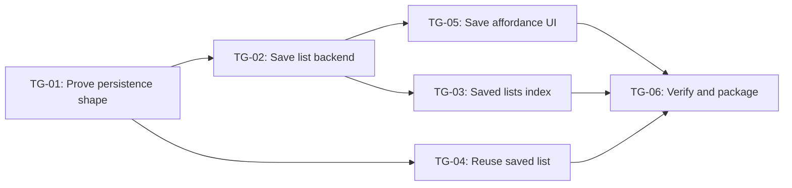
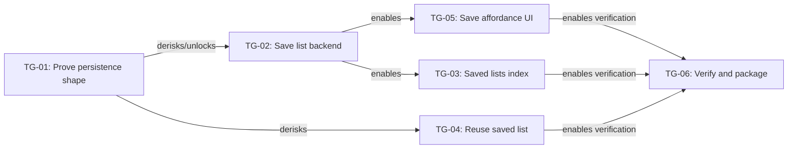
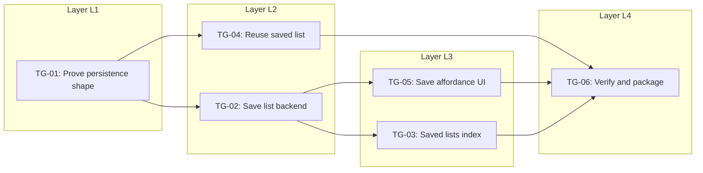
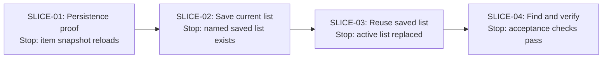

# Implementation Plan: Saved Grocery Lists

## 1. Readiness check

| Dimension | Status | Evidence | Concern | Needed before build? |
|---|---|---|---|---|
| Problem / outcome | clear | Users rebuild the same list every week; goal is save, find, reuse. | None. | no |
| Appetite | clear | Two weeks for a small team. | Scope must stay tight. | no |
| Selected approach | clear | Save current list, view saved lists, reopen/copy into active list. | Copy behavior needs detail. | no, but resolve early |
| Non-goals | clear | No collaboration, sharing, marketplace, sync, version history. | Keep out of slices. | no |
| User-visible behavior | clear | Save, view, reuse. | Replace vs append is unresolved. | yes, before reuse slice |
| System context | partial | Active list in local state; auth and persistence exist. | Existing list-item shape may not persist cleanly. | yes, before full build |
| Risks / unknowns | clear | Persist shape, copy semantics, active/persisted boundary. | These drive sequence. | yes |

## 2. Project boundary

- Source artifact: `examples/simple-feature-prd/source-prd.md`
- Appetite: Two weeks
- Target user / operator: Returning grocery-list user
- Desired outcome: User can save a grocery list, find it later, and reuse it as the starting point for a new shopping trip.
- Selected approach: Lightweight saved-list feature with save, saved-list index, and reuse/copy action.
- Non-goals: Collaboration, sharing, marketplace, real-time sync, version history, bulk management.
- Must-preserve constraints: Minimal UI; authenticated users only; use existing persistence pattern where possible.
- Success definition: Save and reopen at least one list reliably, even if polish and bulk actions are cut.

## 3. Kickoff doc

### Shape in one paragraph

Add a small saved-list feature so a signed-in shopper can name the current active grocery list, persist it, see saved lists later, and copy one back into the active list for reuse. The work should preserve the existing active-list experience and avoid expanding into collaboration, sharing, or advanced list management.

### What we are building

- Save current active list as a named saved list.
- Saved lists index.
- Reuse action that copies saved-list items into the active list.
- Minimal empty/error states.

### What we are not building

- Sharing, collaboration, real-time sync, marketplace templates, version history, bulk actions, or list analytics.

### Key user/system behaviors

- User names and saves current list.
- System persists list name, owner, and item snapshot.
- User views saved lists.
- User selects a saved list and reuses it.
- System creates or updates the active list from the saved item snapshot.

### Technical surfaces likely touched

- Active list state/store.
- Saved-list persistence model.
- Saved lists API or service functions.
- Save-list UI affordance.
- Saved-list index UI.
- Reuse/copy behavior.

### Known risks and unknowns

- Whether current item shape can persist as-is.
- Whether reuse should replace or append to current active list.
- Boundary between temporary active-list state and persisted saved-list records.

### First thing to learn or prove

Can we persist and reload the existing list-item shape without losing required item data?

### What can happen in parallel

After the persistence shape is proven, the saved-list index UI and reuse behavior can proceed in parallel if capacity allows. Before that, UI polish should wait.

### What to show after the first slice

A saved-list record can be created for the current user and inspected/reloaded with the same item data.

### Cut lines if time gets tight

- Cut rename/delete saved list.
- Cut empty-state polish.
- Cut append/merge option; choose one reuse behavior.
- Cut multi-list management polish.

## 4. Technical design plan

### Affected surfaces

| ID | Surface | Existing/New | Why it matters | Notes |
|---|---|---|---|---|
| SURF-01 | Active list state/store | existing | Source of items to save and target for reuse. | Boundary needs inspection. |
| SURF-02 | Saved-list model/table | new | Persists named item snapshots per user. | Keep minimal. |
| SURF-03 | Saved-list service/API | new | Creates, lists, reads saved lists. | Use existing auth/persistence conventions. |
| SURF-04 | Save current list UI | new | User entry point for saving. | Minimal modal or inline name field. |
| SURF-05 | Saved lists index UI | new | Lets user find saved lists. | Empty state can be plain. |
| SURF-06 | Reuse saved list action | new | Copies saved list into active list. | Needs replace vs append decision. |

### Data / state

| ID | Data or state | Created/Read/Updated/Deleted | Owner/source | Persistence | Notes |
|---|---|---|---|---|---|
| STATE-01 | Active list items | Read/Updated | active list store | temp/local existing | Read for save, update for reuse. |
| STATE-02 | Saved list record | Created/Read | saved-list model | db | `id`, `user_id`, `name`, `items_snapshot`, timestamps. |
| STATE-03 | Saved list index | Read | saved-list service | db | User-owned list summaries. |
| STATE-04 | Reuse mode | Decided/Applied | product behavior | none | Choose replace for v1 to avoid merge complexity. |

### Interfaces / contracts

| ID | Interface | Producer | Consumer | Contract / payload / behavior | Open question |
|---|---|---|---|---|---|
| IF-01 | Save saved list | UI | service/API | `{ name, items } -> saved_list` | Validate empty name? |
| IF-02 | List saved lists | service/API | index UI | returns user-owned `{ id, name, item_count, updated_at }[]` | Pagination not needed for v1. |
| IF-03 | Get saved list | service/API | reuse action | returns saved-list detail with item snapshot | None. |
| IF-04 | Apply saved list | reuse action | active list store | replace active items with snapshot | Confirm replace semantics. |

### Technical decisions

| ID | Decision | Rationale | Reversible? | Risk |
|---|---|---|---|---|
| TD-01 | Persist item snapshot, not normalized template system | Faster and fits appetite. | yes | Snapshot shape may drift from active item shape. |
| TD-02 | Reuse replaces active list in v1 | Avoids append/merge edge cases. | yes | User may expect append. |
| TD-03 | Saved-list index shows summaries only | Keeps UI small. | yes | Users may want preview. |

## 5. Assumptions, unknowns, and risks

| ID | Unknown / risk | Why it matters | Earliest way to learn | Related surfaces | Must resolve before |
|---|---|---|---|---|---|
| RISK-01 | Existing item shape may not persist cleanly. | Could force model or adapter work. | Spike save/load one item snapshot. | SURF-01, SURF-02 | TG-02 / SLICE-01 |
| RISK-02 | Replace vs append behavior is unresolved. | Affects UX and active-list update logic. | Decide v1 behavior in kickoff. | SURF-06 | TG-04 / SLICE-03 |
| RISK-03 | Active-list state boundary may be messy. | Could make reuse fragile. | Inspect store and write small apply function. | SURF-01, SURF-06 | TG-04 |

## 6. Raw task dump

| ID | Task | Type | Known/Unknown | Notes |
|---|---|---|---|---|
| T-01 | Inspect active list item shape. | code | unknown | Needed before persistence. |
| T-02 | Spike save/load item snapshot. | code | unknown | Derisks model. |
| T-03 | Define saved-list model. | code/data | known after T-02 | Minimal fields. |
| T-04 | Add create saved-list service/API. | code | known after T-03 | Auth-owned. |
| T-05 | Add list saved-lists service/API. | code | known | Summary fields. |
| T-06 | Add get saved-list detail service/API. | code | known | Needed for reuse. |
| T-07 | Add save current list UI. | design/code | known | Name + save. |
| T-08 | Add saved-lists index UI. | design/code | known | List summaries. |
| T-09 | Decide replace vs append. | product | unknown | Choose replace for v1. |
| T-10 | Implement apply saved list to active list. | code | unknown | Depends on state boundary. |
| T-11 | Add minimal empty/error states. | design/code | known | Cuttable. |
| T-12 | Add acceptance tests/manual checks. | QA | known | End-to-end checks. |
| T-13 | Update tracker/handoff packet after discoveries. | planning | known | Keep artifacts aligned. |

## 7. Task groups / scopes

| ID | Name | Included tasks | Behavior / output produced | Risk state | Cuttable? | Notes |
|---|---|---|---|---|---|---|
| TG-01 | Prove persistence shape | T-01, T-02 | Existing item data can be saved and reloaded. | figuring-it-out | no | Highest unknown. |
| TG-02 | Save list backend | T-03, T-04 | User-owned saved-list record can be created. | not-started | no | Depends on TG-01. |
| TG-03 | Saved lists index backend/UI | T-05, T-08, T-11 | User can see saved lists. | not-started | partly | Empty/error polish cuttable. |
| TG-04 | Reuse saved list | T-06, T-09, T-10 | Saved list replaces active list. | figuring-it-out | no | State-boundary risk. |
| TG-05 | Save affordance UI | T-07 | User can name and save current list. | not-started | no | Depends on TG-02. |
| TG-06 | Verify and package | T-12, T-13 | Checks pass; handoff/tracker updated. | not-started | no | Final quality gate. |

## 8. Interrelationship map

| ID | From | To | Relationship | Why it matters |
|---|---|---|---|---|
| D-01 | TG-01 | TG-02 | derisks / unlocks | Model depends on persistence shape. |
| D-02 | TG-02 | TG-05 | enables | Save UI needs create service. |
| D-03 | TG-02 | TG-03 | enables | Index needs saved records to list. |
| D-04 | TG-01 | TG-04 | derisks | Reuse depends on item snapshot shape. |
| D-05 | TG-04 | TG-06 | enables verification | End-to-end reuse check needs apply behavior. |
| D-06 | TG-03 | TG-06 | enables verification | End-to-end saved-list visibility check. |
| D-07 | TG-05 | TG-06 | enables verification | End-to-end save check. |



## 9. Foliated dependency layers

| Layer | Task groups | Dependency reason | Can start when... | Dependency-parallel candidates |
|---|---|---|---|---|
| L1 | TG-01 | No unmet inbound dependencies and major unknown. | Project starts. | no |
| L2 | TG-02, TG-04 | Both need persistence shape from TG-01. | TG-01 proves or adapts item snapshot. | yes |
| L3 | TG-03, TG-05 | Both need save-list backend from TG-02. | TG-02 create/list paths exist. | yes |
| L4 | TG-06 | Needs save, list, and reuse behaviors. | TG-03, TG-04, TG-05 pass checks. | no |

## 10. Parallelization plan

| Candidate set | Groups | Dependency status | Unknown profile | Capacity conflict? | Decision | Rationale |
|---|---|---|---|---|---|---|
| PSET-01 | TG-02, TG-04 | Same layer after TG-01 | TG-04 has higher state-boundary unknown | possible if same engineer owns state | Start TG-04 spike first; TG-02 can proceed if capacity allows. | Reuse may expose hidden active-list boundary issues. |
| PSET-02 | TG-03, TG-05 | Same layer after TG-02 | Both mostly known | no | Parallelize if designer/engineer capacity exists. | Index and save affordance are separable once backend exists. |

## 11. Build sequence

| Order | Task group | Layer | Why now | What it must enable next | Parallel with | Stop when... |
|---|---|---|---|---|---|---|
| 1 | TG-01 | L1 | Highest project-killing unknown. | Saved-list model and reuse decision. | none | One current-list item snapshot can save and reload with required fields. |
| 2 | TG-04 | L2 | State-boundary unknown could sink reuse. | Reuse slice decision. | TG-02 if capacity allows | Saved-list snapshot can replace active list in a dev path. |
| 3 | TG-02 | L2 | Required for save/index UI. | Save affordance and index. | TG-04 if capacity allows | User-owned saved-list create path works. |
| 4 | TG-05 | L3 | Completes save behavior. | End-to-end save check. | TG-03 | User can name and save active list. |
| 5 | TG-03 | L3 | Completes find behavior. | End-to-end saved-list visibility check. | TG-05 | User can see saved-list summaries. |
| 6 | TG-06 | L4 | Final project proof. | Ship/no-ship decision. | none | Acceptance checks pass or cuts are explicit. |

## 12. Initial vertical slices

| ID | Slice | Purpose | Included task groups | Demo / proof | Acceptance checks | Non-goals |
|---|---|---|---|---|---|---|
| SLICE-01 | Persistence proof | derisk | TG-01 | Save/load item snapshot in dev or test path. | AC-01 | No UI polish. |
| SLICE-02 | Save current list | core behavior | TG-02, TG-05 | User names current list and creates saved-list record. | AC-02 | No rename/delete. |
| SLICE-03 | Reuse saved list | core behavior | TG-04 | User applies saved list to active list. | AC-03 | No append/merge option. |
| SLICE-04 | Find and verify | finishing | TG-03, TG-06 | User sees saved lists and checks end-to-end flow. | AC-04, AC-05 | No bulk actions. |

## 13. Scope cuts and deferrals

| ID | Remove/defer | Preserved behavior | Cost of cutting | Decision trigger |
|---|---|---|---|---|
| CUT-01 | Rename/delete saved list | Save, list, and reuse still work. | Users cannot manage old lists. | If TG-04 takes longer than expected. |
| CUT-02 | Empty/error state polish | Core behavior still works. | Rough UX in edge cases. | If UI work exceeds appetite. |
| CUT-03 | Append/merge option | Replace behavior still supports reuse. | Less flexible reuse. | If copy semantics stay ambiguous. |

## 14. Acceptance checks

| ID | Check | Applies to | Verification method |
|---|---|---|---|
| AC-01 | Existing active-list item snapshot can be persisted and reloaded with required fields intact. | SLICE-01 / TG-01 | automated or dev inspection |
| AC-02 | Signed-in user can save current active list with a name. | SLICE-02 / TG-02 / TG-05 | manual or integration test |
| AC-03 | Signed-in user can reuse a saved list and see active list replaced with saved items. | SLICE-03 / TG-04 | manual or integration test |
| AC-04 | Signed-in user can view saved-list summaries later. | SLICE-04 / TG-03 | manual or integration test |
| AC-05 | Non-goals are not accidentally introduced: sharing, collaboration, marketplace, sync, version history. | project | review |

## 15. Tracker

| Item | Type | State | Layer | Current unknown | Next visible proof | Blocked by | Parallelization note |
|---|---|---|---|---|---|---|---|
| SLICE-01 | slice | figuring-it-out | L1 | Persist item shape | Save/load snapshot proof | none | Do first alone. |
| SLICE-02 | slice | not-started | L2/L3 | None after TG-01 | Named saved list created | TG-01, TG-02 | Can overlap with index after backend. |
| SLICE-03 | slice | figuring-it-out | L2 | Active-list state boundary | Saved list replaces active list | TG-01 | Prioritize before polish. |
| SLICE-04 | slice | not-started | L3/L4 | None major | End-to-end demo | TG-03, TG-05, TG-04 | Final verification. |

## 16. Visual Pack

The tables above are the source of truth. These visuals are review projections for humans and agents.

### 16.1 Dump Board

```text
DUMP
┌────────────────────────────────────────────────────────────┐
│ T-01  Inspect active list item shape                       │
│ T-02  Spike save/load item snapshot                        │
│ T-03  Define saved-list model                              │
│ T-04  Add create saved-list service/API                    │
│ T-05  Add list saved-lists service/API                     │
│ T-06  Add get saved-list detail service/API                │
│ T-07  Add save current list UI                             │
│ T-08  Add saved-lists index UI                             │
│ T-09  Decide replace vs append                             │
│ T-10  Implement apply saved list to active list            │
│ T-11  Add minimal empty/error states                       │
│ T-12  Add acceptance tests/manual checks                   │
│ T-13  Update tracker/handoff packet after discoveries      │
└────────────────────────────────────────────────────────────┘
```

### 16.2 Task Group Grid

```text
TASK GROUP GRID

┌──────────────────────────────┐ ┌──────────────────────────────┐
│ TG-01: Prove persistence     │ │ TG-02: Save list backend     │
│ Tasks: T-01, T-02            │ │ Tasks: T-03, T-04            │
│ State: figuring-out          │ │ State: not-started           │
└──────────────────────────────┘ └──────────────────────────────┘

┌──────────────────────────────┐ ┌──────────────────────────────┐
│ TG-03: Saved lists index     │ │ TG-04: Reuse saved list      │
│ Tasks: T-05, T-08, T-11      │ │ Tasks: T-06, T-09, T-10      │
│ State: not-started           │ │ State: figuring-out          │
└──────────────────────────────┘ └──────────────────────────────┘

┌──────────────────────────────┐ ┌──────────────────────────────┐
│ TG-05: Save affordance UI    │ │ TG-06: Verify and package    │
│ Tasks: T-07                  │ │ Tasks: T-12, T-13            │
│ State: not-started           │ │ State: not-started           │
└──────────────────────────────┘ └──────────────────────────────┘
```

### 16.3 Risk State Board

```text
RISK STATE BOARD

TG-01 Prove persistence shape
Unknown: 2 / 2
Known:   0 / 2
Risk:    [██████████] figuring-out

TG-02 Save list backend
Unknown: 0 / 2
Known:   0 / 2
Risk:    [░░░░░░░░░░] not-started

TG-03 Saved lists index backend/UI
Unknown: 0 / 3
Known:   0 / 3
Risk:    [░░░░░░░░░░] not-started

TG-04 Reuse saved list
Unknown: 2 / 3
Known:   1 / 3
Risk:    [███████░░░] figuring-out

TG-05 Save affordance UI
Unknown: 0 / 1
Known:   0 / 1
Risk:    [░░░░░░░░░░] not-started

TG-06 Verify and package
Unknown: 0 / 2
Known:   0 / 2
Risk:    [░░░░░░░░░░] not-started
```

### 16.4 Interrelationship Diagram



### 16.5 Foliation / Layer Diagram



### 16.6 Parallelization Map

```text
PARALLELIZATION MAP

PSET-01: TG-02 Save list backend + TG-04 Reuse saved list
Dependency status: same layer after TG-01
Unknown profile: TG-04 has higher state-boundary unknown
Capacity conflict: possible if same engineer owns active-list state and persistence
Decision: start TG-04 spike first; TG-02 can proceed if capacity allows
Rationale: reuse may expose hidden active-list boundary issues

PSET-02: TG-03 Saved lists index + TG-05 Save affordance UI
Dependency status: same layer after TG-02
Unknown profile: both mostly known
Capacity conflict: low if UI/API work can split cleanly
Decision: parallelize if designer/engineer capacity exists
Rationale: index and save affordance are separable once backend exists
```

### 16.7 Appetite / Progress Snapshot

```text
APPETITE SNAPSHOT

Appetite: 2 weeks
Elapsed:  0 weeks
Remaining: 2 weeks
Time:     [░░░░░░░░░░░░░░░░░░░░] 0%

Task groups:
Done:          0 / 6
Figured out:   0 / 6
Figuring out:  2 / 6
Not started:   4 / 6
Cut:           0 / 6

Scope pressure: medium
Reason: appetite is short and two core groups carry important unknowns, but no time has elapsed yet.
```

### 16.8 Slice Sequence Map



## 17. Agent handoff packet

```text
Active slice: SLICE-01 — Persistence proof
Source artifacts: examples/simple-feature-prd/source-prd.md
Authority order: user instruction > this implementation plan > source PRD
Must preserve: lightweight saved-list scope; two-week appetite; non-goals around sharing/collaboration/sync/versioning
Do not build: UI polish, sharing, rename/delete, append/merge option, marketplace/template system
Relevant requirements: save current list, reload saved item snapshot later
Relevant technical design decisions: TD-01 snapshot persistence; do not normalize into template system yet
Relevant surfaces/files/modules, if known: active list state/store; persistence layer/model conventions
Included task groups: TG-01
Relevant tasks: T-01, T-02
Dependency layer: L1
Parallelization decision: do first alone because it drives model and reuse decisions
Known unknowns: RISK-01 existing item shape may not persist cleanly
Dependencies: none
Acceptance checks: AC-01
Stop condition: one current-list item snapshot can save and reload with all fields needed for reuse
```
