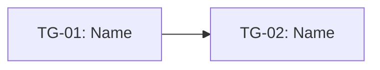

# Implementation Planner and Tracker

Use this skill when a PRD, pitch, or shaped package of work needs to become a technical design plan that humans and agents can build from.

The skill sits between shaping and implementation. It preserves the intent of the product work while translating it into a builder-facing kickoff doc, a technical design outline, initial slices, visual projections, and compact implementation handoff packets.

It is not a generic ticket generator. It is a tool for working on what the work is before doing the work.

## Goal

Produce a plan that answers:

- What are we building, and why this bounded version?
- What technical surfaces, data, state, APIs, integrations, and risks are implicated?
- What has to be figured out first because later work depends on it?
- What can be completed together and judged as a vertical slice?
- Which groups can happen in parallel, and which only appear parallel until unknowns are considered?
- What does done mean relative to the next thing this slice must enable?
- What can be cut or deferred if the appetite runs out?
- What visuals help humans and agents see the dump, task groups, risks, dependencies, layers, sequence, and appetite pressure?
- What exact packet should a human or coding agent receive for the first slice?

## Inputs

Accept any of these:

- PRD
- Shape Up pitch
- shaped package of work
- kickoff notes
- breadboard
- design doc
- transcript or planning notes
- issue / project description
- implementation discovery notes

Prefer source material that includes:

- appetite / time budget
- desired outcome
- selected approach
- non-goals
- constraints
- user-facing behavior
- known risks
- existing system context

If the input is not ready, do not fake certainty. Run the readiness check and label assumptions.

## Output

Create these sections:

1. Readiness check
2. Project boundary
3. Kickoff doc
4. Technical design plan
5. Assumptions, unknowns, and risks
6. Raw task dump
7. Task groups / scopes
8. Interrelationship map
9. Foliated dependency layers
10. Parallelization plan
11. Build sequence
12. Initial vertical slices
13. Scope cuts and deferrals
14. Acceptance checks
15. Tracker
16. Visual Pack
17. Agent handoff packet

## Method

### 1. Readiness check

Before planning implementation, determine whether the input is shaped enough.

| Dimension | Status | Evidence | Concern | Needed before build? |
|---|---|---|---|---|
| Problem / outcome | clear / partial / missing |  |  | yes/no |
| Appetite | clear / partial / missing |  |  | yes/no |
| Selected approach | clear / partial / missing |  |  | yes/no |
| Non-goals | clear / partial / missing |  |  | yes/no |
| User-visible behavior | clear / partial / missing |  |  | yes/no |
| System context | clear / partial / missing |  |  | yes/no |
| Risks / unknowns | clear / partial / missing |  |  | yes/no |

If core shaping is missing, produce a planning-risk warning and continue with explicit assumptions.

### 2. Restate the project boundary

Preserve the shaped intent before technical decomposition.

Include:

- Source artifact
- Appetite / time budget
- Target user or operator
- Desired outcome
- Selected approach
- Non-goals
- Must-preserve constraints
- Success definition

Do not turn the project into tasks until this boundary is clear.

### 3. Write the kickoff doc

The kickoff doc is the builder-facing interpretation of the package.

It should answer the anxieties at handoff:

- Is this possible in the appetite?
- What pieces fit together?
- What should be worked on first?
- What can safely happen in parallel?
- What happens if part of it is harder than expected?
- How will progress be visible without micromanagement?

### 4. Create the technical design plan

Translate the product shape into technical territory without overbuilding.

Affected surfaces:

| ID | Surface | Existing/New | Why it matters | Notes |
|---|---|---|---|---|
| SURF-01 |  | existing/new |  |  |

Data / state:

| ID | Data or state | Created/Read/Updated/Deleted | Owner/source | Persistence | Notes |
|---|---|---|---|---|---|
| STATE-01 |  |  |  | none/temp/db/external |  |

Interfaces / contracts:

| ID | Interface | Producer | Consumer | Contract / payload / behavior | Open question |
|---|---|---|---|---|---|
| IF-01 |  |  |  |  |  |

Technical decisions:

| ID | Decision | Rationale | Reversible? | Risk |
|---|---|---|---|---|
| TD-01 |  |  | yes/no |  |

Do not write production code here. Keep this at design-plan fidelity unless the user explicitly asks to implement a slice.

### 5. Register assumptions, unknowns, and risks

Unknowns are not defects. They are the main scheduling signal.

| ID | Unknown / risk | Why it matters | Earliest way to learn | Related surfaces | Must resolve before |
|---|---|---|---|---|---|
| RISK-01 |  |  |  | SURF-01 | TG-01 / SLICE-01 |

### 6. Dump likely work

Dump everything that may be needed. Do not sequence yet.

Include product, design, code, data, migration, QA, instrumentation, docs, launch, and cleanup when relevant.

| ID | Task | Type | Known/Unknown | Notes |
|---|---|---|---|---|
| T-01 |  | product/design/code/data/QA/launch | unknown |  |

### 7. Cluster into task groups / scopes

Group tasks by what can be completed together and judged in isolation from the rest.

Rules:

- use no more than about 10 groups initially
- do not name the groups before clustering
- name them after seeing what belongs together
- avoid frontend/backend buckets unless that is the real separable concern
- prefer vertical slices of behavior, state, and system consequence

| ID | Name | Included tasks | Behavior / output produced | Risk state | Cuttable? | Notes |
|---|---|---|---|---|---|---|
| TG-01 |  | T-01, T-04 |  | not-started / figuring-it-out / executing-down / done / cut | no |  |

### 8. Map interrelationships

Draw arrows where one task group provides input to another or reduces uncertainty for another.

| ID | From | To | Relationship | Why it matters |
|---|---|---|---|---|
| D-01 | TG-01 | TG-02 | input / unlocks / derisks / blocks |  |

Include Mermaid when it clarifies the map:



Use the map to expose dependencies. Do not decide the final sequence from the map alone.

### 9. Foliate the dependency graph

Foliation turns the interrelationship map into dependency layers.

First ask only the dependency question:

> If all unknowns were equal, what order is valid based on what must feed what?

Process:

1. Identify terminal groups: groups with no outgoing dependency arrows.
2. Work backward/upward from the terminal groups to find what must feed them.
3. Convert the graph into layers of groups that can start once earlier prerequisite layers are satisfied.
4. Mark groups in the same layer as dependency-parallel candidates.
5. Do not yet assume same-layer groups should actually run in parallel; unknowns and capacity still decide that.

| Layer | Task groups | Dependency reason | Can start when... | Dependency-parallel candidates |
|---|---|---|---|---|
| L1 | TG-01, TG-03 | no unmet inbound dependencies | project starts | yes |
| L2 | TG-02 | needs TG-01 output | TG-01 stop condition met | no |

Layering rule:

- A group can appear in a layer only when its required inputs from prior groups are available.
- Groups in the same layer have no direct dependency on each other.
- Same layer means “can be parallelized by dependency,” not “should be parallelized by judgment.”

### 10. Decide parallelization using dependencies plus unknowns

Dependencies and unknowns are two different dimensions.

Use dependency foliation to find the valid starting set. Then use unknowns to choose priority inside that set.

Decision rules:

- If a group is dependency-ready and has a project-killing unknown, start it first or run a spike immediately.
- If two groups are dependency-ready and both are well understood, they can be parallelized if team capacity exists.
- If one group is well understood and another has a major unknown, do not let the well-understood work consume the attention needed to resolve the unknown.
- If a group is dependency-ready but its output is not needed soon, it can wait.
- If two groups look parallel but share a scarce person, fragile code area, or decision-maker, treat them as capacity-conflicted.

| Candidate set | Groups | Dependency status | Unknown profile | Capacity conflict? | Decision | Rationale |
|---|---|---|---|---|---|---|
| PSET-01 | TG-01, TG-03 | same layer | TG-03 has major unknown | no | start TG-03 first, TG-01 can follow/parallel if capacity allows | project fails if TG-03 is not solved |

### 11. Sequence by dependency, unknowns, and right-to-left stop conditions

For each task group, define what it must enable next. Done is relative to what comes next.

Sequence after considering:

1. dependency validity from foliation
2. unknown severity
3. time sensitivity
4. capacity constraints
5. what each group must enable next

| Order | Task group | Layer | Why now | What it must enable next | Parallel with | Stop when... |
|---|---|---|---|---|---|---|
| 1 | TG-03 | L1 | biggest project-killing unknown among valid starts | decision for TG-04 | none | the risky path is proven or cut |

The stop condition should be narrower than “everything eventually needed.” It should say what output the next task group needs as input.

### 12. Define initial vertical slices

A slice is a buildable, judgeable increment. It may contain one task group or a path through several groups.

Each slice should produce a concrete demonstration or proof:

| ID | Slice | Purpose | Included task groups | Demo / proof | Acceptance checks | Non-goals |
|---|---|---|---|---|---|---|
| SLICE-01 |  | derisk / core behavior / finishing | TG-01 |  | AC-01 |  |

Prefer 2–4 initial slices. Do not create a full backlog when the next slice is enough.

### 13. Define scope cuts and deferrals

Variable scope is a feature of the process.

| ID | Remove/defer | Preserved behavior | Cost of cutting | Decision trigger |
|---|---|---|---|---|
| CUT-01 |  |  |  |  |

### 14. Write acceptance checks

Acceptance checks should verify behavior and plan alignment.

| ID | Check | Applies to | Verification method |
|---|---|---|---|
| AC-01 |  | SLICE-01 / TG-01 / project | manual / automated / review |

Good checks:

- prove a user/system behavior end to end
- verify a risk was resolved
- confirm a cut line still leaves a usable version
- keep non-goals out

### 15. Create a tracker

Track at the level of slices and task groups, not individual chores.

| Item | Type | State | Layer | Current unknown | Next visible proof | Blocked by | Parallelization note |
|---|---|---|---|---|---|---|---|
| SLICE-01 | slice | not-started / figuring-it-out / executing-down / done / cut | L1 |  |  |  |  |

### 16. Create the Visual Pack

The Visual Pack is required when enough information exists. It turns the tables into reviewable visual projections. Tables remain the source of truth; visuals help humans and agents see the plan.

Include these outputs:

1. **Dump Board** — raw tasks before structure or order.
2. **Task Group Grid** — tasks clustered into named or unnamed buckets.
3. **Risk State Board** — task groups by uncertainty / certainty / done / cut state.
4. **Interrelationship Diagram** — arrows showing unlocks, feeds, derisks, or blocks.
5. **Foliation / Layer Diagram** — dependency layers over time.
6. **Parallelization Map** — same-layer groups with the actual judgment decision.
7. **Appetite / Progress Snapshot** — time budget, elapsed/remaining time, group states, and scope-pressure signal.
8. **Slice Sequence Map** — initial slices in order with stop conditions.

Use `docs/visual-pack.md` for reusable patterns. Prefer GitHub-compatible Mermaid and plain text boards.

Visual rules:

- Use stable IDs in every visual.
- Do not invent precision. Use placeholders when data is missing.
- Show dependency-parallel separately from judgment-parallel.
- Show unknowns visually when possible.
- Show appetite pressure when a time budget exists.
- Keep visuals plain enough to render in GitHub Markdown.

### 17. Prepare agent handoff packet

End with a compact implementation packet for only the first selected slice.

```text
Active slice:
Source artifacts:
Authority order:
Must preserve:
Do not build:
Relevant requirements:
Relevant technical design decisions:
Relevant surfaces/files/modules, if known:
Included task groups:
Relevant tasks:
Dependency layer:
Parallelization decision:
Known unknowns:
Dependencies:
Acceptance checks:
Stop condition:
```

## Quality bar

A good output:

- preserves the shaped intent before technical decomposition
- answers kickoff anxieties
- makes technical surfaces and risks visible
- avoids a flat to-do backlog
- clusters work into vertical scopes / task groups
- foliates the dependency graph into valid layers
- distinguishes dependency-parallel from judgment-parallel
- sequences by unknowns, dependency, capacity, and right-to-left stop conditions
- defines initial slices that can be judged end to end
- produces a Visual Pack with dump board, task group grid, risk board, diagrams, appetite snapshot, and sequence map
- gives agents one bounded slice at a time
- includes cut lines before scope pressure arrives

## Common failure modes

- Treating the PRD as implementation truth without checking readiness
- Producing a ticket list instead of a technical design plan
- Starting with easy UI work while core unknowns remain hidden
- Treating same-layer work as automatically parallelizable
- Ignoring capacity conflicts between “independent” groups
- Skipping the Visual Pack even when enough information exists
- Overdesigning infrastructure because it will be needed “later later”
- Missing the stop condition for the next slice
- Creating too many slices too early
- Sending the whole plan to the agent instead of a compact first-slice packet
- Treating cut scope as failure instead of appetite discipline
