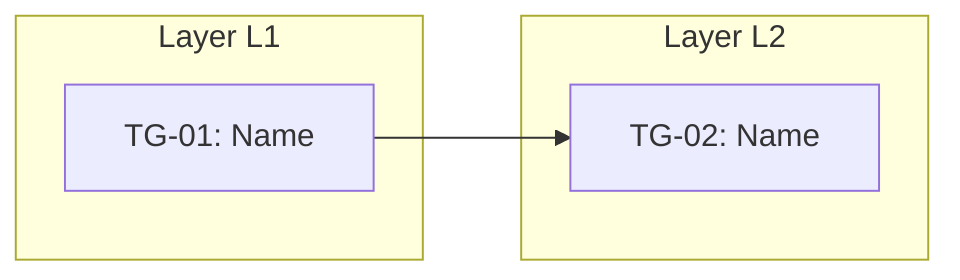
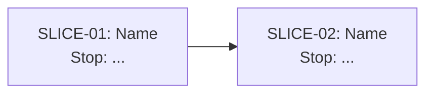

# Implementation Plan

## 1. Readiness check

| Dimension | Status | Evidence | Concern | Needed before build? |
|---|---|---|---|---|
| Problem / outcome |  |  |  |  |
| Appetite |  |  |  |  |
| Selected approach |  |  |  |  |
| Non-goals |  |  |  |  |
| User-visible behavior |  |  |  |  |
| System context |  |  |  |  |
| Risks / unknowns |  |  |  |  |

## 2. Project boundary

- Source artifact:
- Appetite:
- Target user / operator:
- Desired outcome:
- Selected approach:
- Non-goals:
- Must-preserve constraints:
- Success definition:

## 3. Kickoff doc

### Shape in one paragraph

### What we are building

### What we are not building

### Key user/system behaviors

### Technical surfaces likely touched

### Known risks and unknowns

### First thing to learn or prove

### What can happen in parallel

### What to show after the first slice

### Cut lines if time gets tight

## 4. Technical design plan

### Affected surfaces

| ID | Surface | Existing/New | Why it matters | Notes |
|---|---|---|---|---|
| SURF-01 |  |  |  |  |

### Data / state

| ID | Data or state | Created/Read/Updated/Deleted | Owner/source | Persistence | Notes |
|---|---|---|---|---|---|
| STATE-01 |  |  |  |  |  |

### Interfaces / contracts

| ID | Interface | Producer | Consumer | Contract / payload / behavior | Open question |
|---|---|---|---|---|---|
| IF-01 |  |  |  |  |  |

### Technical decisions

| ID | Decision | Rationale | Reversible? | Risk |
|---|---|---|---|---|
| TD-01 |  |  |  |  |

## 5. Assumptions, unknowns, and risks

| ID | Unknown / risk | Why it matters | Earliest way to learn | Related surfaces | Must resolve before |
|---|---|---|---|---|---|
| RISK-01 |  |  |  |  |  |

## 6. Raw task dump

| ID | Task | Type | Known/Unknown | Notes |
|---|---|---|---|---|
| T-01 |  |  |  |  |

## 7. Task groups / scopes

| ID | Name | Included tasks | Behavior / output produced | Risk state | Cuttable? | Notes |
|---|---|---|---|---|---|---|
| TG-01 |  |  |  | not-started |  |  |

## 8. Interrelationship map

| ID | From | To | Relationship | Why it matters |
|---|---|---|---|---|
| D-01 |  |  |  |  |

```mermaid
flowchart LR
  %% TG01["TG-01: Name"] --> TG02["TG-02: Name"]
```

## 9. Foliated dependency layers

| Layer | Task groups | Dependency reason | Can start when... | Dependency-parallel candidates |
|---|---|---|---|---|
| L1 |  |  |  |  |

## 10. Parallelization plan

| Candidate set | Groups | Dependency status | Unknown profile | Capacity conflict? | Decision | Rationale |
|---|---|---|---|---|---|---|
| PSET-01 |  |  |  |  |  |  |

## 11. Build sequence

| Order | Task group | Layer | Why now | What it must enable next | Parallel with | Stop when... |
|---|---|---|---|---|---|---|
| 1 |  |  |  |  |  |  |

## 12. Initial vertical slices

| ID | Slice | Purpose | Included task groups | Demo / proof | Acceptance checks | Non-goals |
|---|---|---|---|---|---|---|
| SLICE-01 |  |  |  |  | AC-01 |  |

## 13. Scope cuts and deferrals

| ID | Remove/defer | Preserved behavior | Cost of cutting | Decision trigger |
|---|---|---|---|---|
| CUT-01 |  |  |  |  |

## 14. Acceptance checks

| ID | Check | Applies to | Verification method |
|---|---|---|---|
| AC-01 |  |  |  |

## 15. Tracker

| Item | Type | State | Layer | Current unknown | Next visible proof | Blocked by | Parallelization note |
|---|---|---|---|---|---|---|---|
| SLICE-01 | slice | not-started | L1 |  |  |  |  |

## 16. Visual Pack

The tables above are the source of truth. The visuals below are projections for review, communication, and agent handoff. See `docs/visual-pack.md` for patterns.

### 16.1 Dump Board

```text
DUMP
┌────────────────────────────────────┐
│ T-01  ...                          │
│ T-02  ...                          │
│ T-03  ...                          │
└────────────────────────────────────┘
```

### 16.2 Task Group Grid

```text
TASK GROUP GRID

┌──────────────────────┐ ┌──────────────────────┐
│ TG-01: Name          │ │ TG-02: Name          │
│ T-01, T-04           │ │ T-02, T-07           │
│ State: figuring-out  │ │ State: not-started   │
└──────────────────────┘ └──────────────────────┘
```

### 16.3 Risk State Board

```text
TG-01 Name
Unknown:  / 
Known:    / 
Risk:    [░░░░░░░░░░] not-started
```

### 16.4 Interrelationship Diagram

```mermaid
flowchart LR
  %% TG01["TG-01: Name"] --> TG02["TG-02: Name"]
```

### 16.5 Foliation / Layer Diagram



### 16.6 Parallelization Map

```text
PSET-01:
Groups:
Dependency status:
Unknown profile:
Capacity conflict:
Decision:
Rationale:
```

### 16.7 Appetite / Progress Snapshot

```text
Appetite:
Elapsed:
Remaining:
Time: [░░░░░░░░░░░░░░░░░░░░] 0%

Task groups:
Done:
Figured out:
Figuring out:
Not started:
Cut:

Scope pressure:
Reason:
```

### 16.8 Slice Sequence Map



## 17. Agent handoff packet

```text
Active slice:
Source artifacts:
Authority order:
Must preserve:
Do not build:
Relevant requirements:
Relevant technical design decisions:
Relevant surfaces/files/modules, if known:
Included task groups:
Relevant tasks:
Dependency layer:
Parallelization decision:
Known unknowns:
Dependencies:
Acceptance checks:
Stop condition:
```
